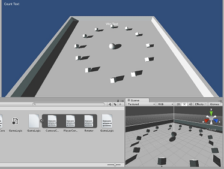
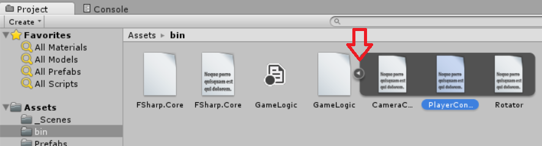

## Unity tutorial: Roll-a-ball F-Sharp



Unity is a multi-platform (3d) game engine.
The basic version of Unity is free.

This repository is the first [tutorial from Unity](http://unity3d.com/learn/tutorials/projects/roll-a-ball/).

The only difference is that F# programming language is used.
No neat functional source code, just plain translation.

It seems that Unity doesn't lock the dlls, so you can build new versions on the fly and still Unity keeps bindings which is great.

You have two options, a) either start from scratch or b) run this solution.

### How to make a similar solution from scratch

* Install some version of Unity (2021.3 LTS or newer recommended) and Visual Studio (2019 or newer) with F# support
* Create a new Unity project as usual
  (Instead of desktop I recommend to put the project something like c:\git\Roll-a-ball )
  [http://unity3d.com/learn/tutorials/projects/roll-a-ball/set-up](http://unity3d.com/learn/tutorials/projects/roll-a-ball/set-up)
  But before proceeding to the second video...
* With Visual Studio create a new F#-library under your Unity's project path. Un-tick the "Create directory for solution" to save one directory. (I used c:\git\Roll-a-ball and created project called GameLogic.) 
* Add references to UnityEngine.dll and UnityEngine.UI.dll (typically found in Unity installation folder under Editor\Data\Managed\ )
* From project properties, set the build "Output path" to some folder under Unity's Assets-folder, for example: ..\Assets\bin\
* Unity 2021+ uses .NET Framework 4.8 or .NET Standard 2.1, so update the target framework accordingly
* For FSharp.Core, the copy-local should be "true" as Unity doesn't have it. The Unity dlls should have copy-local set to "false".
* Write some script, e.g. like this:

```fsharp

namespace RollABall
open UnityEngine

type PlayerController() =
    inherit MonoBehaviour()

    [<SerializeField>]
    let mutable speed = 6.0f

    member x.FixedUpdate () =
        let ``move horizontal`` = Input.GetAxis("Horizontal");
        let ``move vertical`` = Input.GetAxis("Vertical")

        let movement = Vector3(``move horizontal``, 0.0f, ``move vertical``)
        movement * speed * Time.deltaTime
        |> x.GetComponent<Rigidbody>().AddForce

```

 * Now, build in Visual Studio, then switch to Unity and open bin-folder from Assets. From Project-window, you should see your fsharp-dll and a little arrow on its right side to extend the details. When you press the arrow, you see the class(es) inside the component and you can directly drag and drop your class to your game object (like the ball in this tutorial). 

 * Then just continue the tutorial, but instead of creating every snippet a C#-file, just code F#, build the solution (in VS) and Unity notices the new modifications on the fly.

### How to get this repository code running

* Install Unity (2021.3 LTS or newer recommended)
* Install Visual Studio 2019+ with F# support or .NET SDK 6.0+
* Set the UNITY_PATH environment variable to your Unity installation (e.g., `C:\Program Files\Unity\Hub\Editor\2022.3.0f1` or similar)
* Open and build GameLogic\GameLogic.sln with Visual Studio or run `dotnet build` in the GameLogic folder. (Leave VS open...)
* Open project with Unity: Roll-a-ball-FSharp (Yes, the whole folder).
* Open Scene: _Scenes\MiniGame.unity
* For some reason Unity may have lost the references. So you have to map those once: from Hierarchy-tab select Player, then from Inspector-tab under Player Controller (Script) select the small circular button next to Script-textbox. A dialog opens then select PlayerController from the list. Do the same for (Hierarchy-tab again) Main Camera, associate it (from Inspector-tab again) to CameraController. Then from Project-tab under Assets go to Prefabs and select PickUp (Cube-icon). From the Inspector-tab select Rotator (Script) and assign it to Rotator. That's it.
 
### Links

* [Unity](http://unity3d.com)
* [How to use F# libraries with Unity](https://github.com/eriksvedang/FSharp-Unity)

### Notes for Modern Unity Versions

* This project has been updated to work with Unity 2021.3+ and .NET Framework 4.8
* Uses TextMesh for text display (compatible with all Unity versions) instead of newer UI system
* The rigidbody property has been replaced with GetComponent<Rigidbody>() as the property is deprecated
* Project references are now more flexible and can auto-detect Unity installation paths
* Uses modern .NET SDK project format for easier development
* For Unity 2022.1+, consider migrating to .NET Standard 2.1 for better performance
* If Unity installation is not found, the project will fallback to Unity NuGet packages